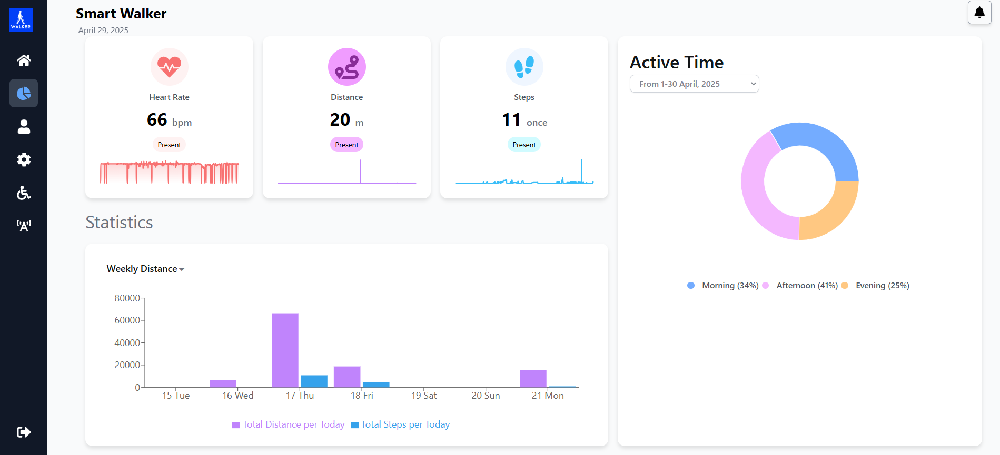
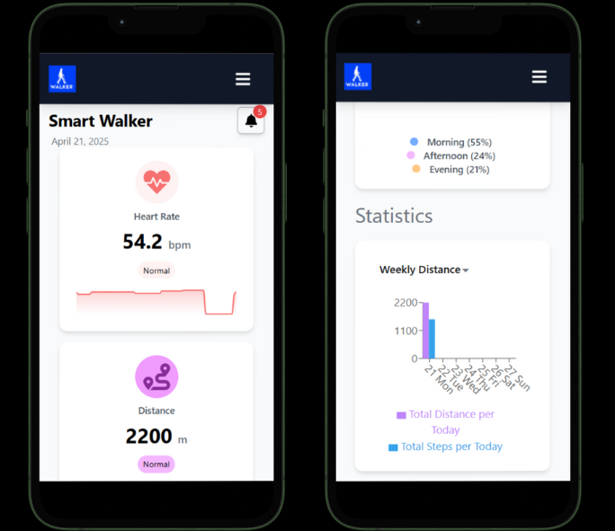
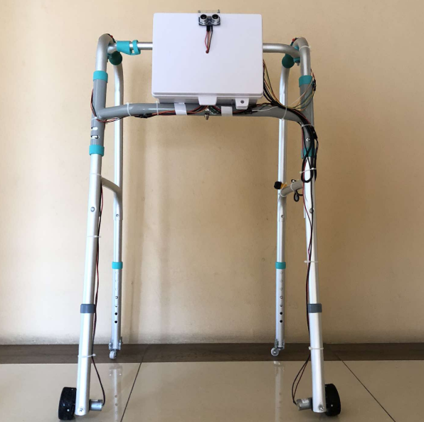

# 🚶‍♂️🤖 Smart Walker System

A smart assistive walking device designed to enhance mobility, safety, and independence for elderly or physically challenged users. This system integrates sensors, microcontrollers, and software to monitor environment, detect obstacles, and support user navigation.

## 📌 Project Overview

The **Smart Walker System** combines hardware and software to create a smarter mobility aid. Key features include:
- 🔍 Obstacle detection using ultrasonic and d80NK
- 🤕 Fall detection using GY-521(MPU6050)+ Gyro
- ⚠️ Real-time alerts on Web Application and Line Notification
- 📱 Mobile/Web dashboard for remote monitoring
- 🔋 Battery management and power efficiency

---

## 🖥️ Dashboard UI

A sample image of the Smart Walker system Dashboard UI, which displays real-time information such as:
- Heart Rate 💓
- Distance walked 🚶
- Number of steps 👣
- Active time during the month 📅
- Weekly distance and steps chart 📊

> Examples from the dashboard clearly show usage over time and health data.

Example image for moblie:
- use CSS and Tailwindcss for Developed

> Examples from the dashboard on moblie.

You can visit my Web here: [SmartWalkerSystem.online](https://smartwalkersystem.online) or [on firebase Hosting](https://walkertest-a907f.web.app/)

---

## 🤖 Smart Walker Project

Here is the image of the Smart Walker project:

> This is a piece of work from the smart walker project.

---

## 🧰 Technologies Used

### Hardware
- Arduino / ESP 32
- Ultrasonic / d80NK / GY-521(MPU6050)+ Gyro
- LCD2004
- Motor Driver Module (L298N)
- DC Motor 
- Battery & Power Supply

### Software
- Python  (Microcontroller)
- Node.js  (Backend)
- React / HTML-CSS (Frontend)
- Firebase  (Database)
- MQTT / Bluetooth / WiFi for communication

---

🙌 Contributors
นาย ณัฐเมศร์ วงศ์ธนิตเลิศ – IoT Developer / Firmware & Sensor Integration 

